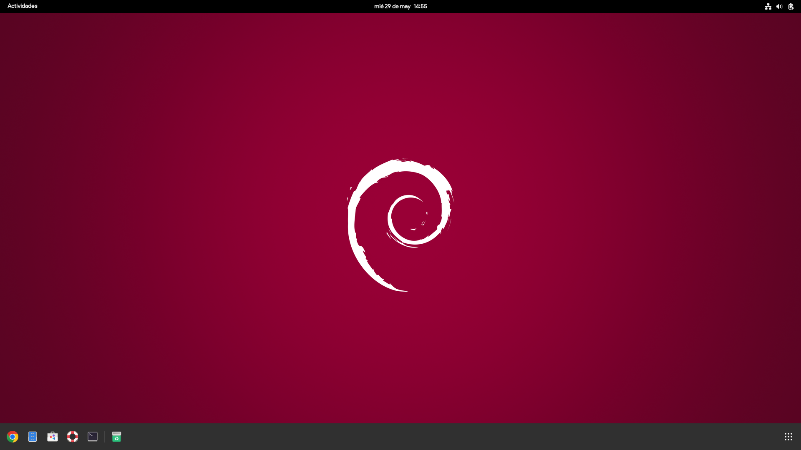
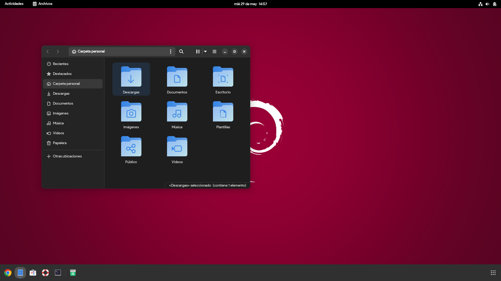
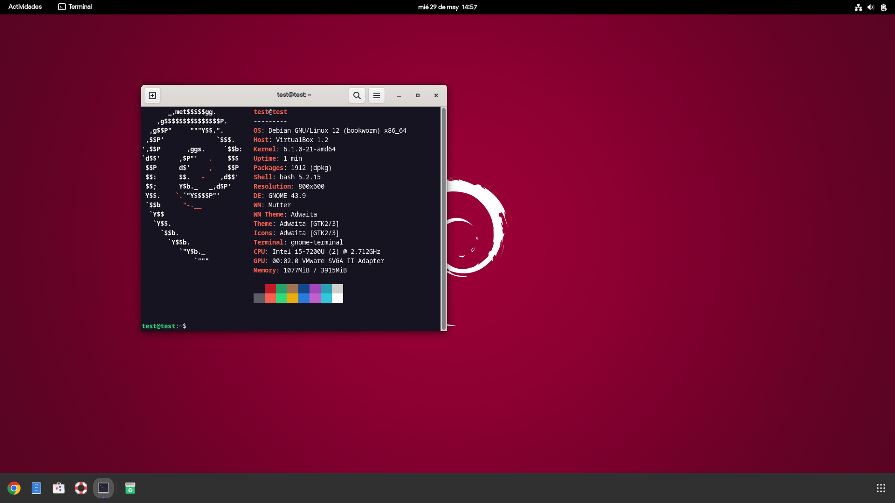

# 🎨 **Personalización y Optimización de Debian 13**

El script realiza una serie de personalizaciones y optimizaciones en un sistema **Debian 13 (Trixie)**. El script mejora el rendimiento del sistema eliminando paquetes innecesarios y aplica una personalización que hace que el sistema sea más bonito a simple vista y más productivo.

El script está adaptado y optimizado específicamente para escritorios **GNOME** (GNOME 48).

## ⚙️ **A continuación se explicará el funcionamiento del Script**

### 1️⃣ Actualización del sistema
- El script actualizará tu sistema con los últimos paquetes y parches de seguridad de Debian 13.

### 2️⃣ Eliminación de paquetes innecesarios (Bloat)
- Remueve automáticamente una serie de paquetes y juegos preinstalados que no suelen ser necesarios, liberando espacio en disco y reduciendo el uso de recursos del sistema.

### 3️⃣ Limpieza de paquetes residuales del sistema
- Realiza una limpieza completa con `--purge` de paquetes y dependencias huérfanas asegurando un sistema limpio.

### 4️⃣ Instalación de software útil
- Se instalan aplicaciones útiles como **Google Chrome**, **neofetch** (adaptado para Debian 13 con ejecutable nativo) y **bpytop** para monitoreo del sistema en tiempo real.

### 5️⃣ Configuraciones estéticas del sistema (GNOME 48)
- El script aplica una serie de configuraciones estéticas ya preestablecidas:
  - **Fuentes**: Fuente Google Product Sans aplicada en interfaz y títulos de ventana.
  - **Fondos de pantalla**: Nuevos fondos de alta definición integrados en el tema activo de Debian 13 (`ceratopsian-theme` / `active-theme`).
  - **Barra de tareas / Dock**: Integración de Dash to Dock totalmente compatible con GNOME 48 y arquitectura ESM.
  - **Tema de Plymouth**: Animación de arranque moderna `deb13`.
  - **GRUB**: Fondo negro limpio y resolución de pantalla optimizada.

### 6️⃣ Reinicio del sistema
- El script ofrece la opción de reiniciar el sistema para aplicar todos los cambios inmediatamente.

## ✏️ **Posibilidad de personalización del Script**

Este script puede ser modificado por el usuario según sus necesidades:
- **`dconf-settings.ini`**: Puedes editar las claves de GNOME antes de ejecutar o recompilar con `dconf compile`.
- **Paquetes**: Modifica la lista `bloat_packages` o `extra_packages` en `setup.sh`.
- **Fondos**: Añade o cambia las imágenes en la carpeta `Backgrounds/`.

## 🚀 **Cómo ejecutar el Script**

1. Descarga o clona el repositorio:
    ```sh
    git clone https://github.com/aetherbeyondstars/Debian13.git
    cd Debian13
    ```
2. Otorga permisos de ejecución y ejecuta como superusuario:
    ```sh
    sudo chmod +x setup.sh
    sudo ./setup.sh
    ```

## 🖼️ **Imágenes**







